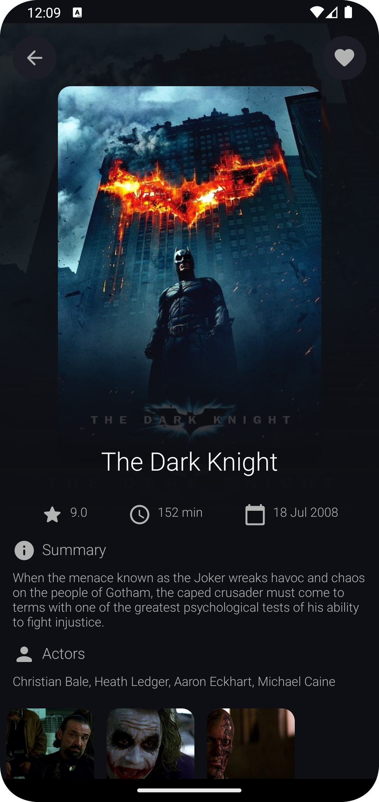
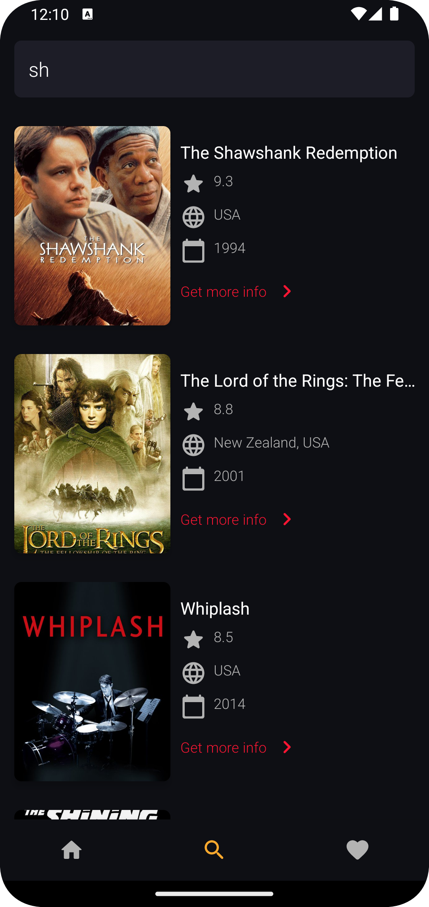
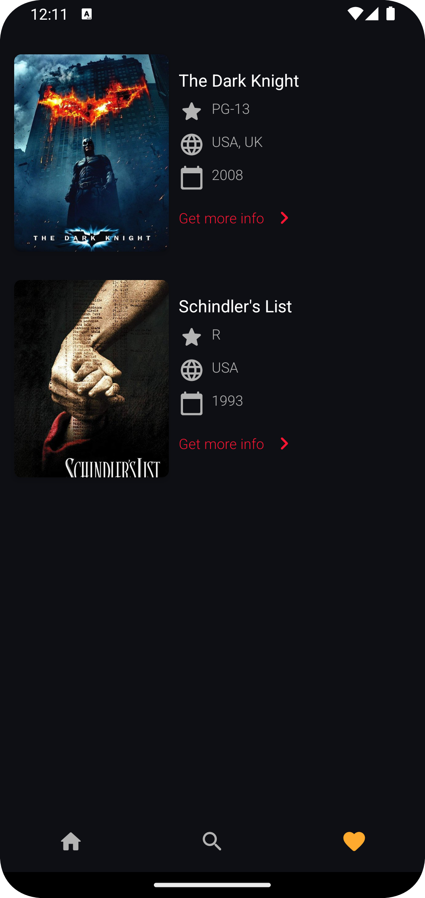

# TopMovies App With Kotlin

The application works with api  " http://moviesapi.ir "

Technologies and Libraries Used :

* MVVM
* DI (Hilt)
* ViewBinding
* Coroutines
* Retrofit
* Livedata
* RoomDb
* DiffUtil
* RecyclerView
* DataStore Preferences
* Navigation Components
* Xml

# Screenshot

        

        
